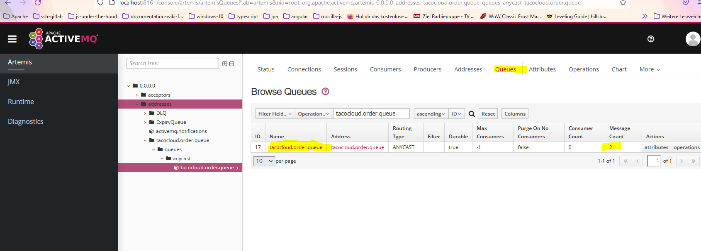

### Run this the artemis MQ.

D:\programming\servers\apache\artemis\spring-in-action-broker\bin>artemis.cmd run

### Create messages
In the posmtan collection use post-taco-order.
This stores the order in the queue and the db.

### Monitor the qrtemis queue
In the browser go to: 
> http://localhost:8161/console/auth/login

Login with: 
un: admin
pw: admin

Got to tab Queue and select tacocloud.order.queue.
To see the content of the single queues click on message count.

